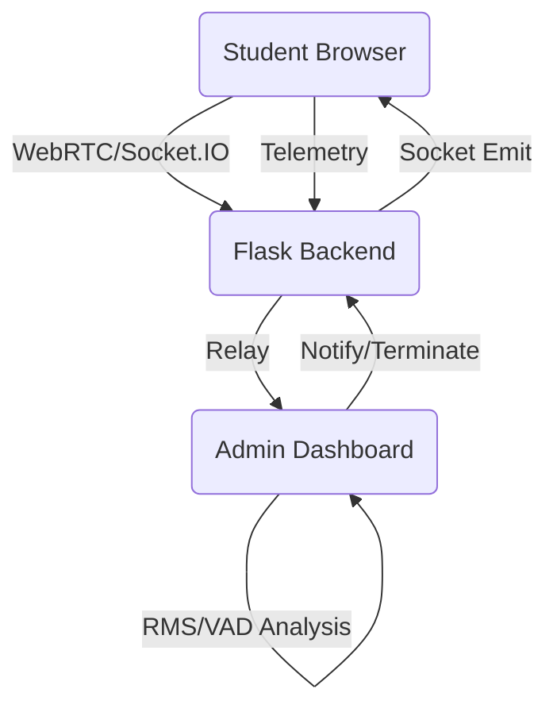

# 🦅 AI-Vision Smart Proctor: Advanced Online Cheat Detection

[]()
[]()
[]()

**AI-Vision Smart Proctor** is a cutting-edge, hybrid proctoring solution designed to maintain the highest level of integrity for online examinations. It combines low-latency WebRTC video streaming with a powerful proctoring engine that performs real-time eye-gaze tracking, head-pose estimation, object detection, and admin-centric voice analysis.

---

## 🚀 Key Features

### 📡 Hybrid Live Streaming
- **Dual-Mode Feed**: Seamlessly switches between high-speed **WebRTC P2P** streaming for fluid observation and a robust **MJPEG fallback** for unstable connections.
- **Selective Targeting**: Admins can monitor specific students with high-priority video feeds without overloading the server.

### 🧠 Advanced Proctoring Engine
- **Vision Analytics**: Real-time detection of eye gaze (off-screen), head pose (excessive rotation), and prohibited objects (mobile phones, books, etc.).
- **Security Heuristics**: Automated detection of devtools usage, tab switching, and system tampering.
- **Integrity Verification**: Sophisticated anti-tamper verification that cross-references client-side telemetry with server-side validation.

### 🎙️ Admin-Side Voice Detection
- **Raw Audio Relay**: Student PCM audio is relayed directly to the proctor's dashboard in real-time.
- **Local Analysis**: Detection logic runs locally on the admin's machine to identify speech patterns, minimizing server load and maximizing privacy.
- **Interactive Alerts**: Admins can trigger immediate interactive warnings ("I Understand" popups) back to students.

### 🛡️ Admin Control Suite
- **Live Dashboard**: A premium, grid-based dashboard providing real-time telemetry, suspicion scores, and safety levels for all participants.
- **Remote Termination**: Force-terminate exam sessions with professional integrity reports in case of critical violations.
- **Observation Mode**: Stealth or active observation modes with detailed metric overlays.

---

## 🏗️ System Architecture



### 🔭 The Technology Stack
- **Backend**: Python, Flask, Flask-SocketIO, Eventlet.
- **Frontend**: Vanilla JavaScript (ES6+), WebAudio API, WebRTC (SimplePeer), Canvas 2D/3D.
- **Proctoring Core**: Custom-built WebAssembly-backed inference engine for vision tasks.

---

## 🛠️ Setup & Installation

### Prerequisites
- Python 3.8+
- Node.js (for asset compilation)
- MySQL/MariaDB (for persistent logging)

### Installation
1.  **Clone the Repository**:
    ```bash
    git clone https://github.com/Sineha123/online-cheat-detection.git
    cd online-cheat-detection
    ```
2.  **Environment Setup**:
    ```bash
    python -m venv venv
    source venv/bin/activate
    pip install -r requirements.txt
    ```
3.  **Database Configuration**:
    Import the provided `.sql` file and update DB credentials in `app.py`.
4.  **Run the Server**:
    ```bash
    python app.py
    ```

---

## 📜 Security Policy & Integrity
This system uses a **Synchronized Asset Integrity** mechanism. Any changes to the core proctoring scripts must be synced using the provided scripts to update the cryptographic manifest:
```bash
bash scripts/sync_proctor_assets.sh
```

---

## 🤝 Contribution
Contributions are welcome! Please ensure all pull requests follow the standard code style and include relevant documentation for new proctoring heuristics.

---

**Built with ❤️ by the AI-Vision Team.**
