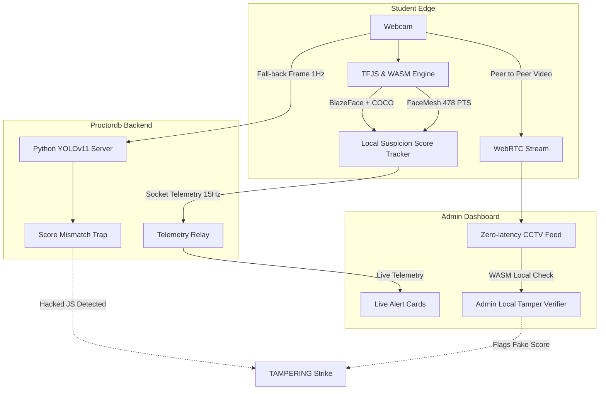

<h1 align="center">
  
</h1>

<div align="center">

  
  
  
  
  
  
  

  <br />
  <b>A highly-scalable, privacy-preserving AI proctoring system using Edge AI inference.</b>
  <br />
</div>

---

## 📖 The Vision & Problem Statement

As remote learning scales, traditional server-side proctoring faces massive bottlenecks:
1. **Bandwidth Costs**: Streaming 30fps video from 1,000 students to a central server requires immense pipe capacity.
2. **GPU Compute Costs**: Running heavy Object Detection (YOLO) and Facial Landmarking (MediaPipe) on a central server for thousands of concurrent streams is incredibly expensive.
3. **Latency**: By the time a server detects a student looking at a phone, the student might have already hidden it due to network round-trip delays.

**This project flips the paradigm.** By pushing heavy computer vision models to the **Edge** via WebAssembly (WASM) and WebGL, we achieve:
- 🚀 **Zero-latency** inference (~30 FPS directly in the student's browser)
- 📉 **99% reduction** in server bandwidth and GPU costs
- 🔒 **Privacy-by-Design** (No mass video streaming to third-party APIs)

---

## 🏗 System Architecture (Hybrid Edge/Server)

The project leverages a **Hybrid Detection Architecture** combining client-side speed with server-side trust verification.



### How the Hybrid Architecture Works ⚙️
1. **Client-Side Heavy Lifting:** The browser downloads lightweight TFJS models. The student's webcam feed is processed entirely locally.
2. **High-Speed Telemetry:** The browser emits high-speed compressed JSON (Suspicion Score, Face counts, Active Flags) via WebSockets to the Flask server.
3. **WebRTC Video Stream:** A Peer-to-Peer connection is forged between the Student and Admin for Live CCTV.
4. **The Trap (Anti-Tampering):** To prevent students from modifying the local Javascript to return a `0` score, the admin can click **"🛡️ Verify Tamper"**. This runs the admin's local WASM instance against the student's live feed. If the student's self-reported score drastically differs from the admin's calculation, they are flagged for massive cheating.

---

## 🔥 Key Detections Matrix

| Detection Type | Embedded AI Model | Rule & Enforcement |
|---|---|---|
| **Multiple Faces / No Face** | *BlazeFace / Haar Cascade* | Flags if another person sits in, or if the student leaves the camera view. |
| **Gaze Tracking** | *MediaPipe Iris Nodes* | Detects if the student is reading off a hidden screen left/right. |
| **Head Pose Tracking** | *MediaPipe FaceMesh* | Calculates 3D geometry (Yaw/Pitch/Roll) to detect physical head turning. |
| **Prohibited Objects** | *COCO-SSD / YOLOv11* | Detects cell phones (class `67`), books (class `73`), and laptops (class `63`). |
| **Eyes Closed (Sleep)** | *Eye Aspect Ratio (EAR)* | Measures distance between eyelid landmarks to detect sleeping or blindness hacking. |
| **Environment Violations** | *Web APIs* | Catches tab-switching (`visibilitychange`), fullscreen exit, and background noise (`Web Audio API`). |

---

## 🛠 For Developers: Comprehensive Deep Dive

### 1. Directory Structure & File Roles
```text
.
├── app.py                       # 🚀 Core backend (Auth, API, Sockets, Video Relay)
├── face_pipeline.py             # 👤 MediaPipe Python Wrapper (Server fallback)
├── person_pipeline.py           # 📦 YOLOv11 Python Wrapper (Server fallback)
├── decision_engine.py           # 🧠 Root temporal debouncing & scoring logic
├── config_vision.py             # ⚙️ Master Python threshold config
├── static/
│   ├── proctor_engine/          # ⚡ The Edge AI Payload
│   │   ├── runtime/             # Core WASM evaluation logics (proctor_core.js)
│   │   ├── config/              # Client-side thresholds (detection_config.js)
│   │   ├── ort/                 # ONNX Runtime Web bundle
│   │   └── models/              # ONNX/TFJS pre-trained weights
│   └── css/ js/ img/
├── templates/                   # 🎨 Jinja2 HTML Templates (Dashboards, Exam Interface)
├── scripts/                     # 🔨 DevOps & Sync utilities
└── requirements.txt             # 📦 PIP Dependencies
```

### 2. The Socket.IO Telemetry Payload
The student client streams metadata at high frequency to the server. This allows admins to monitor 100+ students on a single screen without rendering video.

**Channel:** `telemetry_update_v2`
```json
{
  "safety_level": 85,
  "risk_score": 15,
  "verdict": "GOOD_TO_GO",
  "face_count": 1,
  "person_count": 1,
  "banned_labels": ["cell phone"],
  "active_flags": {
    "no_face": false,
    "multiple_faces": false,
    "banned_object": true,
    "bad_lighting": false,
    "looking_away": false
  }
}
```

### 3. Core Database Schema (`examproctordb`)

- **`students`**: Core auth logic. Includes `ID`, `Name`, `Email`, `Password` (pbkdf2 hashed), `Role` (ADMIN/STUDENT).
- **`profiles`**: Links to `students.ID`. Stores base64/blob paths of the student's initial Face Registration for identity locking.
- **`exam_sessions`**: Tracks active exams. Includes `SessionID`, `StudentID`, `StartTime`, `EndTime`, `Status` (IN_PROGRESS, COMPLETED, TERMINATED).
- **`violations`**: The central logging table for cheating. Includes `ViolationType`, `Details`, `Timestamp`. Types include `TAB_SWITCH`, `MULTIPLE_FACES`, `TAMPER_DETECTED`.
- **`exam_results`**: Final scoring. Links `SessionID` to output grades.

*Foreign Keys strictly use `ON DELETE CASCADE`.*

### 4. How to Tweak AI Sensitivity
To configure how strict the AI is, developers must modify two files to keep the Client and Server in sync:

**Frontend (Client Edge)**: `static/proctor_engine/config/detection_config.js`
```javascript
export const DETECTION_CONFIG = {
  yaw_threshold: 18,        // Degrees head can turn left/right
  pitch_threshold: 15,      // Degrees head can tilt up/down
  multiple_faces_risk: 75,  // Instant massive score penalty
  banned_object_risk: 40    // Risk added per prohibited item detected
};
```

**Backend (Server Fallback)**: `config_vision.py`
```python
YAW_THRESHOLD_DEG = 18
PITCH_THRESHOLD_DEG = 15
TIME_NO_FACE = 3.0 # Seconds before strike
WARNING_COOLDOWN_SEC = 5
```

### 5. API Endpoints Reference
**Auth & Users**
- `POST /login`: Validates credentials, sets secure `HttpOnly` cookie session.
- `POST /register`: Registers user, hashes password via Werkzeug.
- `POST /api/register_face`: Accepts base64 image, validates exactly 1 face exists via `face_pipeline`, saves to `profiles`.

**Telemetry & Proctoring**
- `GET /api/admin/student-telemetry/<student_id>`: Returns the ring-buffered history of the last 200 telemetry ticks for a student.
- `POST /api/admin/tamper-flag`: Webhook triggered by the Admin's Local Verifier if a score mismatch is detected. Auto-terminates the student.
- `GET /admin/active-students-v2`: JSON polling endpoint for legacy dashboard fallback.
- `GET /admin/live/<student_id>`: MJPEG legacy video streaming route (bypassed if WebRTC succeeds).

---

## 💻 Installation & Setup Guide

### 1. Host Requirements
- **OS**: Linux / macOS / Windows
- **Python**: 3.9 or higher
- **Database**: MySQL Server 5.7+ or MariaDB 10.4+
- **Hardware**: Any modern machine. (GPU is entirely optional since AI runs on the client Edge!).

### 2. Step-by-Step Installation

```bash
# 1. Clone the repository
git clone https://github.com/your-org/online-cheat-detection.git
cd online-cheat-detection

# 2. Setup Virtual Environment (Highly Recommended)
python3 -m venv venv
source venv/bin/activate  # (On Windows: venv\Scripts\activate)

# 3. Install Python Dependencies
pip install -r requirements.txt

# 4. Hydrate the MySQL Database
mysql -u root -p < examproctordb.sql

# 5. Download Fallback ONNX Weights
python download_yolo_models.py

# 6. Synchronize WASM Integrity Hashes
# This script ensures the Edge payloads are fingerprinted to prevent student tampering
chmod +x scripts/sync_proctor_assets.sh
./scripts/sync_proctor_assets.sh

# 7. Boot the Flask Server Eventlet Worker
python app.py
```

### 3. Accessing the System
- **Student Portal:** `http://127.0.0.1:5001/`
- **Admin Dashboard:** `http://127.0.0.1:5001/admin/dashboard`
  
> [!IMPORTANT]
> **WebRTC & MediaDevices Security**: Browsers rigorously restrict WebCam and Microphone access. You **must** access this application via `localhost`, `127.0.0.1`, or a valid SSL certificate (`https://`). Bypassing this will cause `getUserMedia` to fail silently.

---

## 🛡️ Security & Hardening Measures

- **Zero-Trust Client Telemetry**: While the Edge AI calculates the score, the server never fully trusts it. Random 1Hz frame polling ensures the client hasn't modified the Javascript runtime to return `{verdict: "GOOD_TO_GO"}`.
- **Password Cryptography**: PBKDF2-SHA256 iterations via Werkzeug.
- **Session Hardening**: Secure, HTTP-Only cookies utilizing the `SameSite=Lax` policy to prevent CSRF.
- **RBAC Strict Routing**: The `@require_role('ADMIN')` decorator wraps all sensitive routes and socket namespaces.
- **WASM Payload Integrity**: `manifest.json` hashes the core scripts to prevent Man-In-The-Middle or local proxy injection of compromised AI engines.

---

<br>
<p align="center">
  <i>Built to make online education fairer, faster, and truly scalable.</i>
</p>
<p align="center">
  
</p>
